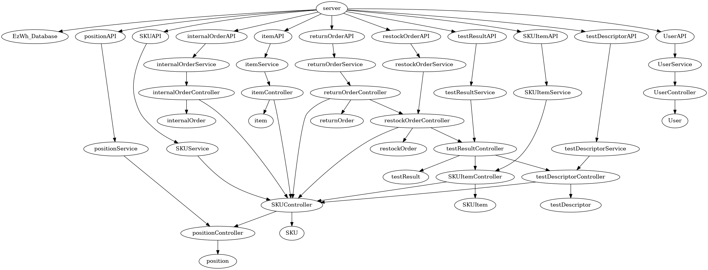

# Integration and API Test Report

Date: 25/05/2022

Version: 1.0

# Contents

- [Dependency graph](#dependency graph)

- [Integration and API Test Report](#integration-and-api-test-report)
- [Contents](#contents)
- [Dependency graph](#dependency-graph)
- [Integration approach](#integration-approach)
- [Integration Tests](#integration-tests)
  - [Step 1 - Unit Tests of the classes in the controllers](#step-1---unit-tests-of-the-classes-in-the-controllers)
  - [Step 2 - Unit Tests of the classes in the services](#step-2---unit-tests-of-the-classes-in-the-services)
  - [Step 3](#step-3)
- [Coverage of Scenarios and FR](#coverage-of-scenarios-and-fr)
- [Coverage of Non Functional Requirements](#coverage-of-non-functional-requirements)
    

# Dependency graph 

     
# Integration approach

The integration approach is **Bottom-Up**, consisting of the following steps:

- **Step 1**: Unit Tests of the leaf classes, where the classes in the controllers are tested.
- **Step 2**: Testing of the classes in the services, where mock is used.
- **Step 3**: API class tested, where both the controller classes and the service classes are tested.
    

#  Integration Tests

## Step 1 - Unit Tests of the classes in the controllers
| Classes  | Jest test cases |
|--|--|
| InternalOrderController | All the methods present in the class DBintlOrderController.test.js |
| ItemController | All the methods present in the class DBItemController.test.js |
| PositionController | All the methods present in the class DBpositionController.test.js |
| RestockOrderController | All the methods present in the class DBresOrderController.test.js |
| ReturnOrderController | All the methods present in the class DBretOrderController.test.js |
| SKUController | All the methods present in the class DBSKUController.test.js |
| SKUItemController | All the methods present in the class DBSKUItemController.test.js |
| TestDescriptorController | All the methods present in the class DBTestDescriptorController.test.js |
| TestResultController | All the methods present in the class DBTestResultController.test.js |
| UserController | All the methods present in the class DBUserController.test.js |

## Step 2 - Unit Tests of the classes in the services
| Classes  | Mock up used | Jest test cases |
|--|--|--|
| InternalOrderService | mockIntOrderController.js | All the methods present in the class intOrderServiceTest.test.js |
| ItemService | mockItemController.js | All the methods present in the class ItemServiceTest.test.js |
| PositionService | mockPositionController.js | All the methods present in the class PositionService.test.js |
| RestockOrderService | mockResOrderController.js | All the methods present in the class resOrderServiceTest.test.js |
| ReturnOrderService | mockRetOrderController.js | All the methods present in the class retOrderServiceTest.test.js |
| SKUService | mockSKUController.js | All the methods present in the class SKUService.test.js |
| SKUItemService | mockSKUItemController.js | All the methods present in the class SKUItemService.test.js |
| TestDescriptorService | mockTestDescriptorController.js |All the methods present in the class TestDescriptorServiceTest.test.js |
| TestResultService | mockTestResultController.js | All the methods present in the class TestResultServiceTest.test.js |
| UserService | mockUserController.js | All the methods present in the class UserServiceTest.test.js |

## Step 3 - API tests (+ Leaf classes)

   
| Classes  | Jest test cases |
|--|--|
| InternalOrderAPI | All the methods present in the class DBintlOrderController.test.js and intOrderServiceTest.test.js |
| testItemAPI | All the methods present in the class DBItemController.test.js and ItemServiceTest.test.js |
| testPositionAPI | All the methods present in the class DBpositionController.test.js and PositionService.test.js |
| testRestockOrderAPI | All the methods present in the class DBresOrderController.test.js and resOrderServiceTest.test.js |
| testReturnOrderAPI | All the methods present in the class DBretOrderController.test.js and retOrderServiceTest.test.js |
| testSKUAPI | All the methods present in the class DBSKUController.test.js and SKUService.test.js |
| testSKUItemAPI | All the methods present in the class DBSKUItemController.test.js and SKUItemService.test.js |
| testTestDescriptorAPI | All the methods present in the class DBTestDescriptorController.test.js and TestDescriptorServiceTest.test.js |
| testTestResultAPI | All the methods present in the class DBTestResultController.test.js and TestResultServiceTest.test.js |
| testUserAPI | All the methods present in the class DBUserController.test.js and UserServiceTest.test.js |

# Coverage of Scenarios and FR

| Scenario ID | Functional Requirements covered | Mocha  Test(s) | 
| ----------- | ------------------------------- | ----------- | 
|  1-1        | FR 2.1                          | Methods in testSKUAPI.js and testSKUItemAPI.js           |             
|  1-2        | FR 2.1                          | Methods in testSKUAPI.js and testSKUItemAPI.js           |             
|  1-3        | FR 2.1                          | Methods in testSKUAPI.js and testSKUItemAPI.js           |             
|  2-1        | FR 3.1.1                        | Methods in testPositionAPI.js            |
|  2-2        | FR 3.1.1                        | Methods in testPositionAPI.js            |
|  2-3        | FR 3.1.1                        | Methods in testPositionAPI.js            |
|  2-4        | FR 3.1.1                        | Methods in testPositionAPI.js            |
|  2-5        | FR 3.1.2                        | Methods in testPositionAPI.js            |
|  3-1        | FR 5.3, FR 5.6                  | Methods in testRestockOrderAPI.js            |
|  3-2        | FR 5.3, FR 5.6                  | Methods in testRestockOrderAPI.js            |
|  4-1        | FR 1.1, FR 1.5                  | Methods in testUserAPI.js            |
|  4-2        | FR 1.1, FR 1.5                  | Methods in testUserAPI.js            |
|  4-3        | FR 1.2                          | Methods in testUserAPI.js            |
|  5-1-1      | FR 5.8.3                        | Methods in testRestockOrderAPI.js            |
|  5-2-1      | FR 5.8.2                        | Methods in testRestockOrderAPI.js            |
|  5-2-2      | FR 5.8.2                        | Methods in testRestockOrderAPI.js            |
|  5-2-3      | FR 5.8.2                        | Methods in testRestockOrderAPI.js           |
|  5-3-1      | FR 5.8.3                        | Methods in testRestockOrderAPI.js            |
|  5-3-2      | FR 5.8.3                        | Methods in testRestockOrderAPI.js            |
|  5-3-3      | FR 5.8.3                        | Methods in testRestockOrderAPI.js            |
|  6-1        | FR 5.10, FR 5.11                | Methods in testReturnOrderAPI.js            |
|  6-2        | FR 5.10, FR 5.11                | Methods in testReturnOrderAPI.js            |
|  7-1        | FR 1                            | Methods in testUserAPI.js            |
|  7-2        | FR 1                            | Methods in testUserAPI.js            |
|  9-1        | FR 6.1, FR 6.6                  | Methods in InternalOrderAPI.js            |
|  9-2        | FR 6.6                          | Methods in InternalOrderAPI.js            |
|  9-3        | FR 6.6                          | Methods in InternalOrderAPI.js            |
|  10-1       | FR 6.7                          | Methods in InternalOrderAPI.js            |
|  11-1       | FR 7                            | Methods in testItemAPI.js            |
|  11-2       | FR 7                            | Methods in testItemAPI.js            |

# Coverage of Non Functional Requirements

### 

| Non Functional Requirement | Test name |
| -------------------------- | --------- |
|       NFR3                 |   API login user type   |
|       NFR4                 |   Adding a new position ,modifing position id of position |
|       NFR6                 |   Modifying SKU data, delete SKU , adding SKU |
|       NFR9                 |   Test Update TestResult by ID, add new restockOrder, adding restockOrder transportNote, adding a new returnOrder, adding a new internalOrder  |
