# Design Document 

Authors: FABIO TROVERO,MARCO MILANI,DIEGO TOMAS GAZMURI LOYOLA

Date: 25/5/2022

Version:2.1 : minor changes for change request

# Contents

- [Design Document](#design-document)
- [Contents](#contents)
- [Instructions](#instructions)
- [High level design](#high-level-design)
- [Low level design](#low-level-design)
- [Verification traceability matrix](#verification-traceability-matrix)
- [Verification sequence diagrams](#verification-sequence-diagrams)
        - [Scenario 1-1, CREATE SKU S](#scenario-1-1-create-sku-s)
        - [Scenario 1-2 MODIFY SKU LOCATION](#scenario-1-2-modify-sku-location)
        - [Scenario 3-1, RESTOCK ORDER OF SKU S ISSUED BY QUANTITY](#scenario-3-1-restock-order-of-sku-s-issued-by-quantity)
        - [Scenario 4-3, DELETE USER](#scenario-4-3-delete-user)
        - [Scenario 5-1-1, RECORD RESTOCK ORDER ARRIVAL](#scenario-5-1-1-record-restock-order-arrival)
        - [Scenario 6-1, RETURN ORDER OF SKU ITEMS THAT FAILED QUALITY TEST](#scenario-6-1-return-order-of-sku-items-that-failed-quality-test)
        - [Scenario 7-1, LOGIN](#scenario-7-1-login)
        - [Scenario 9-1, INTERNAL ORDER IO ACCEPTED](#scenario-9-1-internal-order-io-accepted)
        - [Scenario 11-1, CREATE ITEM](#scenario-11-1-create-item)

# Instructions

The design must satisfy the Official Requirements document, notably functional and non functional requirements, and be consistent with the APIs

# High level design 

_Architecture_:
* EZWh is a **stand-alone** application.

_Architectural patterns_:
* MVC, Users can modify data and consequently views must change
* layered, 3 tiered architecture, used to model the interfacing of sub-systems
* Client-Server model, EzWh is a distributed system model which shows how data and processing is distributed acreoss a range of components

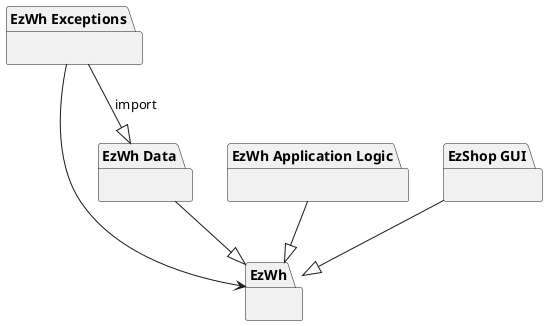

# Low level design

```plantuml
@startuml
top to bottom direction



class Item {
  +ID : integer
  +description :String
  +price :float
  +SKUId : integer
  +supplierID:integer
  
  +getID() :integer
  +setDescription(String) :void
  +setPrice(float) :void
  +setSKUId(integer) :void
  +setSupplierID(integer) :void
  
  +newItem(String,float,integer,integer) :void
  +deleteItem() :integer
}


class RestockOrder {
  +ID : integer
  +issueDate : date
  +state [ISSUED - DELIVERY - DELIVERED - TESTED - COMPLETEDRETURN - COMPLETED]
  +products : List<object>
  +transportNotes :List<object>
  +supplierId : integer
  
  +getID() :integer
  +setIssueDate(date) :void
  +setState(String) :void
  +setProducts(List<Object>) :void
  +setSupplierID(integer) :void
  +setTransportNotes(List<Object>)

  +getItemsReturned() :List<Object>
  
  +newRestockOrder(date,String,list<object>) :void
  +deleteRestockOrder() :integer
}

class TransportNote {
  +Shipment date :date

  +getDate() :date
  +setDate(date) :void
  
}

class ReturnOrder {
  +ID :integer
  +Return date :date
  +products List <object>
  +restockOrderId:integer
  +getID() :integer
  +setIssueDate(date,list<object>,integer) :void 
  +newReturnOrder(date) :void
  +deleteReturnOrder() :integer
}

class SKU {
  +ID :Integer
  +description :String
  +weight : integer
  +volume :integer
  +price :float
  +notes :String
  +quantity :integer
  +position :object
  +testDescriptors : List<object>

  +getID() :integer
  +setDescription(String) :void
  +setWeight(integer) :void
  +setVolume(integer) :void
  +setPrice(integer) :void
  +setNotes(String) :void
  +setQuantity(integer) :void
  +setPosition(Object) :void
  +setTransportNotes(List<Object>)

  +newSKU(String,integer,integer,string,float,integer) :void
  +deleteSKU() :integer
 
}



class SKUItem {
  +RFID : long integer
  +Available [0 - 1] :boolean
  +DateofStock :date
  +SKUId :integer

  +getRFID() :integer
  +getAvailable() :boolean
  +getDate() :Date
  +setAvailable(boolean) :void
  +setSKUId(integer) :void
  +setDate(date) :void
    
  +newSKUItem(integer,date,integer) :void
  +deleteSKUItem() :integer
}

class TestDescriptor {
  +ID :integer
  +name :String
  +procedure description :String
  +SKUId :integer

  +getId() :integer
  +setName(String) :void
  +setDescription(String) :void
  +setSKUId(integer) :void

  +newTD(string,string,integer) :void
  +deleteTD() :integer
}

class TestResult {
  +ID :integer
  +date :date
  +result :boolean
  +testDescriptorID :integer

  +getId() :integer
  +getResult() : boolean
  +getDate() :date
  +setDate(date) :void
  +setResult(boolean) :void
  +setTestDescriptorID(integer) :void

  +newTR(date,boolean,integer) :void
  +deleteTR() :integer

}

class Warehouse{
    UserList : List<Object>
    ReturnOrderList : List<Object>
    RestockOrderList : List<Object>
    InternalOrderList : List<Object>
    TestDescriptorList : List<Object>
    TestResultList : List<Object>
    SKUList : List<Object>
    ItemList : List<Object>
    SupplierList : List<Object>
    SKUItemList : List<Object>
    PositionList : List<Object>
}

class Position {
  +positionID :integer
  +aisle :integer
  +row :integer
  +col :integer
  +max weight :integer
  +max volume :integer
  +occupied weight :integer
  +occupied volume :integer

  +getId() :integer
  +getMaxWeight() : integer
  +getMaxVolume() : integer
  +setAisle(integer) :void
  +setRow(integer) :void
  +setCol(integer) :void
  +setMaxWeight(integer) :void
  +setMaxVolume(integer) :void
  +setOcupiedWeight(integer) :void
  +setOcupiedVolume(integer) :void

  +newPosition(integer,integer,integer,integer,integer,integer) :void
  +deletePosition() :integer

}

class InternalOrder {
  +ID :integer
  +date :date
  +from : integer
  +state [ISSUED - ACCEPTED - REFUSED - CANCELED - COMPLETED] :String
  +products : List<object>

  +getID() :integer
  +getState() :String
  +setDate(date) :void
  +setFrom(String) :void
  +setState(String) :void
  +setProducts(List<Object>) :void

  +newInternalOrder(date,integer,list<object>) :void
  +deleteInternalOrder() :integer
}

class Controller{
    +storeUser(,string,string,string,string,string) :void
    +getSupllierUsers() :List<object>
    +getStoredUsersNoManager():List<object>
    +getUserById(int) <object>
    +getStoredUsers() :List<object>
    +updateUserRights(string) :void
    +deleteUser(string) :void
    +checkLogin(string,string,string) :object
    
    
    
    +getRestockOrder() :List<object>
    +storeRestockOrder(date,String,list<object>) :void
    +modifyState(integer,String) :void
    +deleteRestockOrder(integer) :void
    +returnItemsNOQt(integer) :object
    +getRestockOrderIssued() :List<object>
    +getRestockOrderbyID(integer) :object
    +addSKUItems(integer,string):void
    +addTradportNote(integer,string):void
    

    +getReturnOrder() :List<object>
    +deleteReturnOrder(integer) :void
    +storeReturnOrder(date,list<object>,integer) :void
    +getReturnOrderbyID(integer) :object
    +deleteReturnOrderbyId(integer):void


    +getInternalOrders() :List<object>
    +storeInternalOrder(date,integer,list<object>) :void
    +modifyState(integer,string,integer,object) :void
    +deleteInternalOrder(integer) :void
    +getInternalOrderbyID(integer) :object
    +getInternalOrderState(string):object

    +getStoreItem() :List<object>
    +storeItem(String,float,integer,integer) :void
    +updateItem(integer,String,float) :void
    +deleteItem(integer,integer) :void
    +getItemsyID(integer,integer) :object
    
    +getStoreItembyID(integer) :object

    +getAllSuppliers() :List<object>

    +getSKUs() :List<object>
    +ModifySKU(integer,string,integer,integer,string,float,integer,object) :void
    +DeleteSKU(int) :void
    +createSKU(String,integer,integer,string,float,integer) :void
    +setSKUPosition(object)
    +getSKUbyID(int) :object

    
    +getSKUItems() :List<object>
    +getAvailableSKUItemsBySKUId(integer)
    +getSKUItembyRFID(string) :object
    +createSKUItem(long,date,integer) :void
    +modifySKUItem(long,boolean,date) :void
    +DeleteSKUItems(string) :void

    +getTestDescriptorByID(int) :object
    +getStoreTestDescriptors() :List<object>
    +storeTestDescriptor(string,string,integer) :void
    +updateTestDescriptor(integer,string,string,integer) :void
    +deleteTestDescriptor(integer):void
    
    +getStoreTestResults() :List<object>
    +storeTestResult(date,boolean,integer) :void
    +updateTestResult(integer,date,boolean,integer) :void
    +DeleteTestResult(int,string) :void
    +getTestResultbyRFID(string) :list<object>
    +getTestResultById(integer,string):object


    +getPositions() :List<object>
    +CreatePosition(integer,integer,integer,integer,integer,integer) :void
    +modifyPosition(integer,integer,integer,integer,integer,integer,integer,integer) :void
    +modifyPositionIDOfPosition(integer,integer,integer,integer,integer,integer,integer):void
    +deleteSKUItemInPosition(integer):void
    +DeletePoistion(string) :void
    
    
    +resetTable():void
}
class Service{
    +getAllIntO():list<object>    
    +getIntObyId(integer):object
    +getAllIntObyState(string):list<object>

    +getAllItem():list<object> 
    +getItem(integer,integer):

    +getAllPositions():list<object> 

    +getAllresO():list<object> 
    +getResObyId(integer):object
    +getresObyState():list<object> 


    +getAllretO():list<object> 
    +getRetObyId(integer):object

    +getAllSKUItems():list<object> 
    +getAvailableSKUItemsBySKUIdServ():list<object> 
    +getItemByRFID(string):object

    +getAllSKUs():list<object> 
    +getSKUByIdServ(integer):object

    +getAllTestDescriptor():list<object> 
    +getTestDescriptor(integer):object

    +getTestResultsRFID():list<object> 
    +getTestResultID(integer):object

    +getAllUser():list<object> 
    +getUser(integer):object
    +getSuppliers():list<object> 
    +getUsersNoManager():list<object> 
    +login(string,string):object


    +store(object):void
    +update(object,integer):void
    +delete(integer)


}
class User{
    +id:integer
    +username :String
    +name :String
    +surname :String
    +password :String
    +type :String

    
    +setPassword(String) :void
    +setSurname(String) :void
    +setName(String) :void
    +setUsername(String) :void
    +setType(String) :void
    
    +newUser(string,string,string,string,string) :void
    +deleteUser() :integer
}   

class Product{
    +SKUId :integer
    +description:string
    +price:float
    +RFID:string
    +Itemid:integer
}



Service <-down- Warehouse : <<implements>>
Service -down-> Controller
SKU -- "*" SKUItem
SKU -- "*" Item : corresponds to 
RestockOrder -- "0..1" TransportNote
SKU "*" -- "*" TestDescriptor
TestDescriptor -- "*" TestResult
SKU "1" -- "1" Position
InternalOrder -- "*" SKU
InternalOrder "0..1" -- "*" SKUItem
SKUItem -- "*" TestResult
SKUItem "*" -- "0..1" Position
Warehouse -- "*" Position
RestockOrder -- "*" SKUItem
RestockOrder -- "*" Item
RestockOrder -- "0..1" ReturnOrder : refers 


Controller -- "*"SKU
Controller -- "*"User
Controller -- "*"RestockOrder
Controller -- "*"ReturnOrder
Controller -- "*"InternalOrder
Controller -- "*"TestDescriptor
Controller -- "*"TestResult
Controller -- "*"Item


@enduml
```

# Verification traceability matrix

|     | Warehouse |  User  | RestockOrder | ReturnOrder | SKU |  SKUItem | TestDescriptor | TestResult | Position | InternalOrder| Item |
| --- | :----: | :--------: | :-----------: | :--------: | :-----: | :-----------------: | :--------------------: | :---:| :---:| :---:| :---:|
| FR1 |X|X| | | | | | | | | |
| FR2 |X| | | |X| | | | | | |
| FR3 |X| | | | | |X| |X| | |
| FR4 |X|X| | | | | | | | | |
| FR5 |X|X|X|X|X|X| |X|X| | |
| FR6 |X| | | |X|X| | | |X| | 
| FR7 |X| | | | | | | | | |X| 

# Verification sequence diagrams 

##### Scenario 1-1, CREATE SKU S
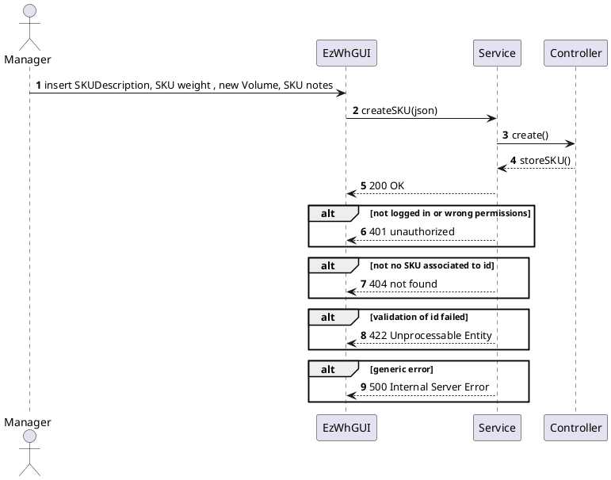
##### Scenario 1-2 MODIFY SKU LOCATION
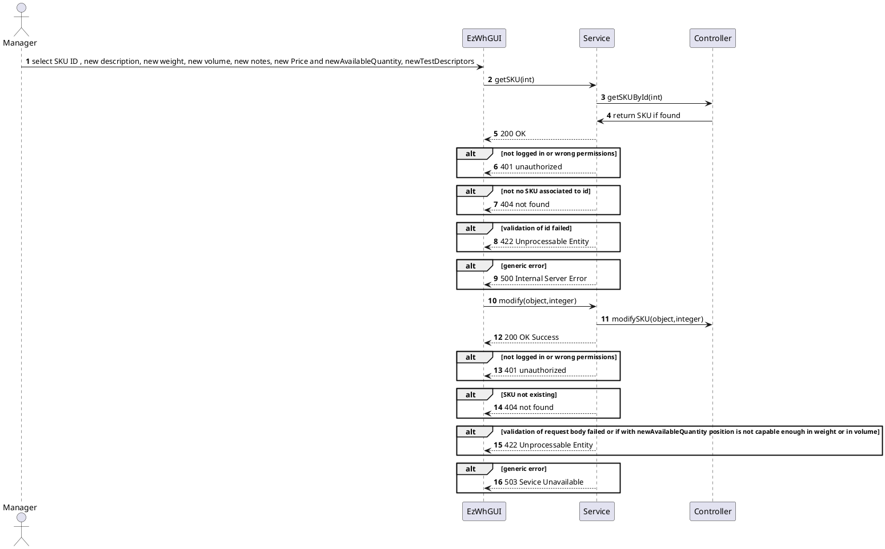

##### Scenario 3-1, RESTOCK ORDER OF SKU S ISSUED BY QUANTITY
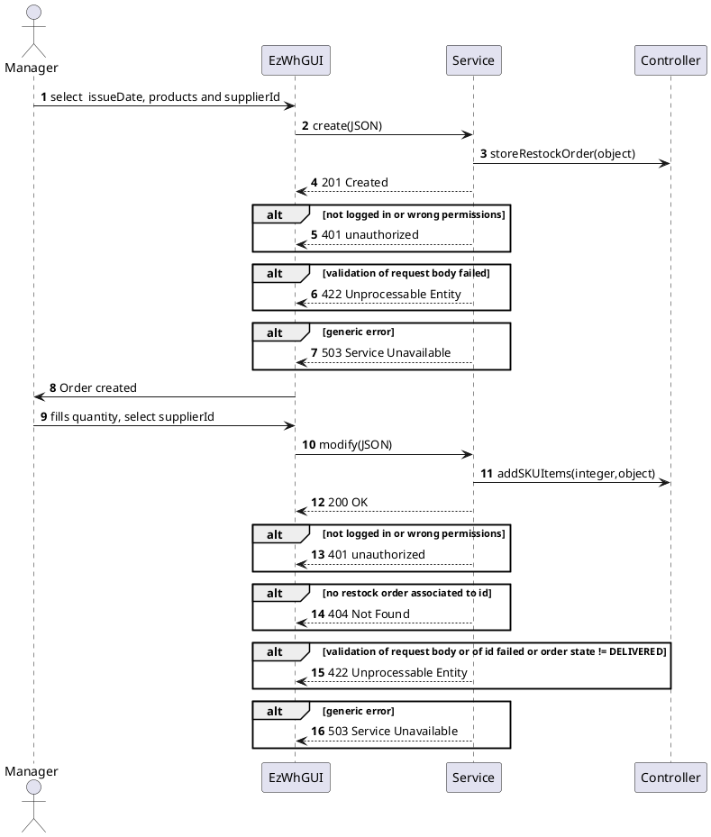

##### Scenario 4-3, DELETE USER
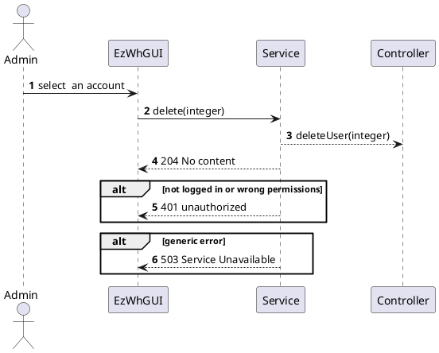

##### Scenario 5-1-1, RECORD RESTOCK ORDER ARRIVAL
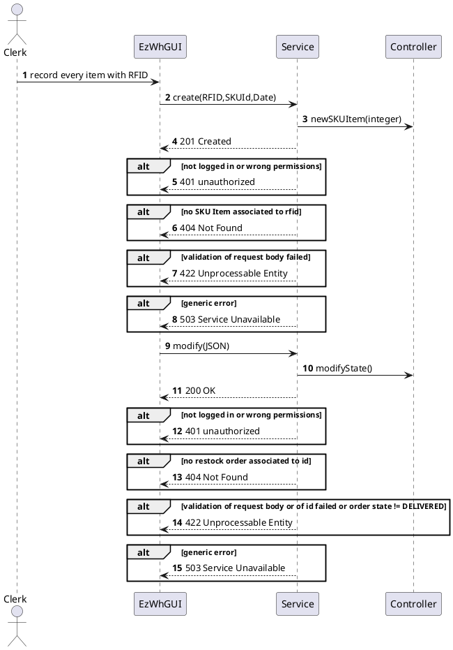

##### Scenario 6-1, RETURN ORDER OF SKU ITEMS THAT FAILED QUALITY TEST
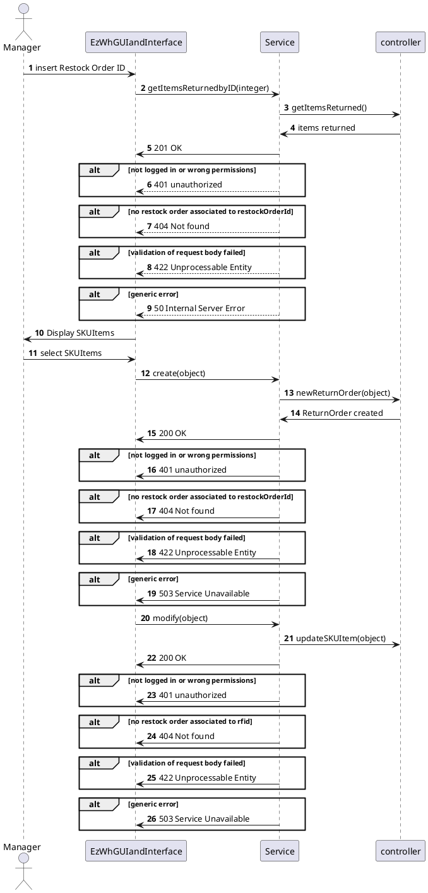
##### Scenario 7-1, LOGIN

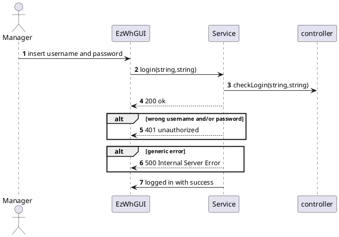

##### Scenario 9-1, INTERNAL ORDER IO ACCEPTED

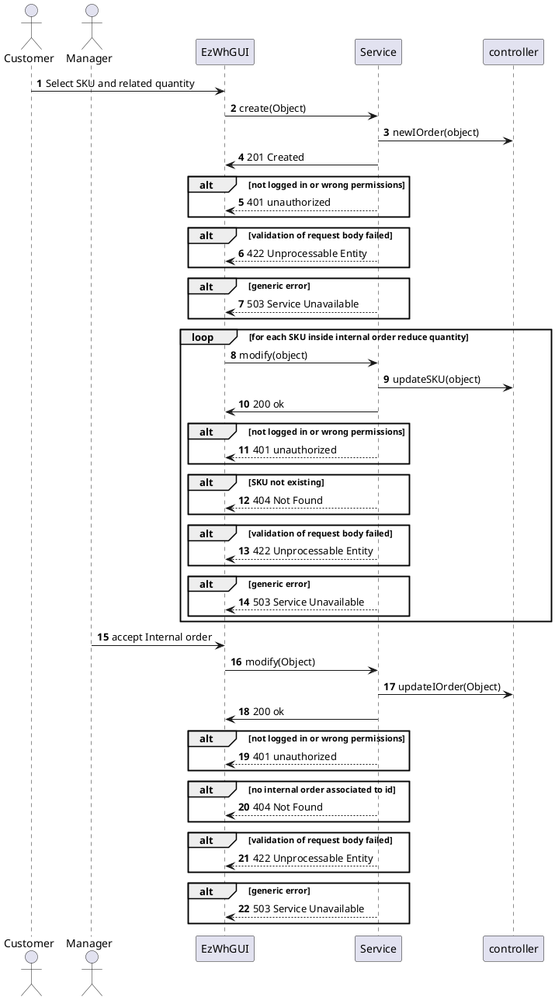

##### Scenario 11-1, CREATE ITEM

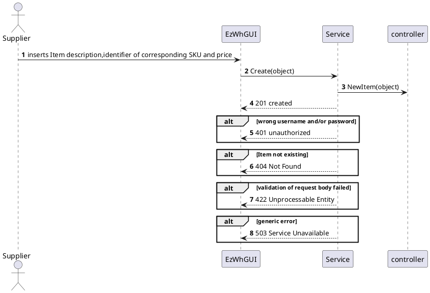
