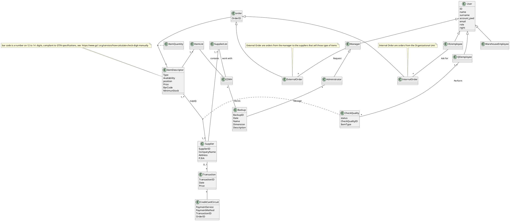
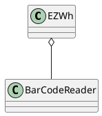
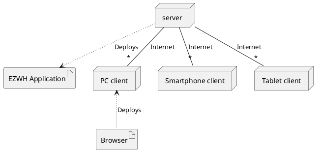

# Requirements Document - EZ WH

Date: April 13th 2022

Version: 1.2

 
| Version number | Change |
| ----------------- |:-----------:|
| 1.1 | First document |
| 1.2 |  Access right table added |


# Contents

- [Informal description](#informal-description)
- [Stakeholders](#stakeholders)
- [Context Diagram and interfaces](#context-diagram-and-interfaces)
	+ [Context Diagram](#context-diagram)
	+ [Interfaces](#interfaces) 
	
- [Requirements Document - EZ WH](#requirements-document---ez-wh)
- [Contents](#contents)
- [Informal description](#informal-description)
- [Stakeholders](#stakeholders)
- [Context Diagram and interfaces](#context-diagram-and-interfaces)
	- [Context Diagram](#context-diagram)
	- [Interfaces](#interfaces)
- [Stories and personas](#stories-and-personas)
- [Functional and non functional requirements](#functional-and-non-functional-requirements)
	- [Functional Requirements](#functional-requirements)
		- [Access right, actor vs function](#access-right-actor-vs-function)
	- [Non Functional Requirements](#non-functional-requirements)
- [Use case diagram and use cases](#use-case-diagram-and-use-cases)
	- [Use case diagram](#use-case-diagram)
		- [Use case 1, UC1   Manage users and rights](#use-case-1-uc1---manage-users-and-rights)
				- [Scenario 1.1](#scenario-11)
				- [Scenario 1.2](#scenario-12)
				- [Scenario 1.3](#scenario-13)
		- [Use case 2, UC2 Organizational Unit requests items](#use-case-2-uc2-organizational-unit-requests-items)
				- [Scenario 2.1](#scenario-21)
		- [Use case 3, UC3 Manage warehouse items](#use-case-3-uc3-manage-warehouse-items)
				- [Scenario 3.1](#scenario-31)
				- [Scenario 3.2](#scenario-32)
				- [Scenario 3.3](#scenario-33)
				- [Scenario 3.4](#scenario-34)
		- [Use case 4, UC4 External Order Item](#use-case-4-uc4-external-order-item)
				- [Scenario 4.1](#scenario-41)
				- [Scenario 4.2](#scenario-42)
				- [Scenario 4.3](#scenario-43)
		- [Use case 5, UC5 Manage quality of service](#use-case-5-uc5-manage-quality-of-service)
				- [Scenario 5.1](#scenario-51)
		- [Use case 6, UC6 reject item](#use-case-6-uc6-reject-item)
				- [Scenario 6.1](#scenario-61)
				- [Scenario 6.2](#scenario-62)
		- [Use case 7, UC7 Manage suppliers](#use-case-7-uc7-manage-suppliers)
				- [Scenario 7.1](#scenario-71)
				- [Scenario 7.2](#scenario-72)
				- [Scenario 7.3](#scenario-73)
		- [Use case 8, UC8 Manage backup](#use-case-8-uc8-manage-backup)
				- [Scenario 8.1](#scenario-81)
				- [Scenario 8.2](#scenario-82)
				- [Scenario 8.3](#scenario-83)
				- [Scenario 8.4](#scenario-84)
- [Glossary](#glossary)
- [System Design](#system-design)
- [Deployment Diagram](#deployment-diagram)

# Informal description
Medium companies and retailers need a simple application to manage the relationship with suppliers and the inventory of physical items stocked in a physical warehouse. 
The warehouse is supervised by a manager, who supervises the availability of items. When a certain item is in short supply, the manager issues an order to a supplier. In general the same item can be purchased by many suppliers. The warehouse keeps a list of possible suppliers per item. 

After some time the items ordered to a supplier are received. The items must be quality checked and stored in specific positions in the warehouse. The quality check is performed by specific roles (quality office), who apply specific tests for item (different items are tested differently). Possibly the tests are not made at all, or made randomly on some of the items received. If an item does not pass a quality test it may be rejected and sent back to the supplier. 

Storage of items in the warehouse must take into account the availability of physical space in the warehouse. Further the position of items must be traced to guide later recollection of them.

The warehouse is part of a company. Other organizational units (OU) of the company may ask for items in the warehouse. This is implemented via internal orders, received by the warehouse. Upon reception of an internal order the warehouse must collect the requested item(s), prepare them and deliver them to a pick up area. When the item is collected by the other OU the internal order is completed. 

EZWH (EaSy WareHouse) is a software application to support the management of a warehouse.


# Stakeholders


| Stakeholder name  | Description | 
| ----------------- |:-----------:|
|  Credit card circuit    |  Provides payment services           | 
|  Manager     |   Monitors inventory, does accounting, manages supply orders        | 
|  Supplier     |  Receives orders, provides products      | 
|  Quality office    |  Checks quality of items       | 
|  Administrator    |  Installs the application, mantains it, defines users, assigns privileges           | 
|  Organizational unit   |  Receives internal orders, provides products           | 
|  Warehouse  employee   |  Transports items inside warehouse,manages delivery (to pick up areas)  | 
|  Warehouse    |  Physical space  | 
|  Competitors  | Other softwares to manage warehouse | 
|  Companies  | Companies that use the app to manage their warehouse| 


# Context Diagram and interfaces

## Context Diagram
```plantuml
top to bottom direction
actor Administrator as a
actor Manager as m
actor :Organizational Unit: as ou
actor :Warehuuse employee: as WE
actor :Quality Office: as QO
actor :Credit Card Unit: as CCU
actor Supplier as s
a -up-|> m
m -> (EZWH)
ou -> (EZWH)
WE -> (EZWH)
QO -> (EZWH)
(EZWH) -> s
(EZWH) -> CCU
```
## Interfaces

| Actor | Logical Interface | Physical Interface  |
| ------------- |:-------------:| -----:|
|   Manager     | GUI | Screen keyboard mouse on pc/touch smartphone |
|   Supplier     | e-mail gateway | Internet connection |
|   Quality office   | GUI | Screen keyboard mouse on pc/touch smartphone |
|   Administrator     | GUI | Screen keyboard mouse on pc/touch smartphone |
|   Organizational unit     | GUI | Screen keyboard mouse on pc/touch smartphone |
   Credit card circuit     | API, https://developer.visa.com/docs | Internet connection|

# Stories and personas

**Nadia** is a manager and supervises the warehouse. She is a middle aged woman who was promoted to this job two years ago. Nadia accomplishes department objectives by managing staff, planning and evaluating department activities. She also monitors the inventory and when needed she manages supply orders. Currently she has to do item orders every week over her office phone, something that she would like to automatize to minimize the time lost.

**George** is the app administrator. He is a 30 year old engineer who was hired to develop the app three years ago. Nowadays, Geroge is in charge of managing the application. He has to update it if needed and check that all components work (database, network, bugs of software, etc.). He also manages permissions and regulates the access users have to the application.

**Richard** is a warehouse employee. He is 48 years old and has worked in the company for two decades. Richard is responsible for transporting items inside the warehouse and stocking them in the right place. He also prepares packages of items when an order is received by an internal organizational unit. He does not have much knowledge of how to work with technology, since he has worked without it most of his life, so he needs the entire system to be very intuitive and simple.

**Joey** works in the quality office. He is in his early 20s and this is his first job. His main responsibility is to apply tests to the products that are sent to him, determining if they meet the quality standards set by the company. If they do not, he needs to change the status of the products in the application. If they do, he needs to send the products back to the warehouse to be stored.

# Functional and non functional requirements

## Functional Requirements

| ID        | Description  |
| ------------- |:-------------:| 
|  FR1     | Manage users and rights  (users are Administrator, Manager, Organizational unit, quality office, warehouse employee) |
|  FR1.1    |Define a new user and right|
| FR1.2  | Delete a user| 
|  FR1.3    | List all users |
|  FR1.4    | Search a user  | 
| FR1.5  |  Modify an existing user |  
| FR2 | Organizational Unit request items |
| FR2.1 | Manage internal order |
|  FR3   | Manage warehouse items  |
| FR3.1  | Define new items or modify an existing one| 
|  FR3.2   | Delete an item  |
|  FR3.3   | List all item  |
|  FR3.4   | Search an item |
| FR3.5 | Modify an item | 
| FR3.6 | Find position for an item|
| FR3.7 | Modify position for an item|
| FR3.8 | Read barcode on item| 
|  FR4  | External order Item  |
|  FR4.1  | Issue an order for a item type |
|  FR4.2  | Pay an order for a item type|
|  FR4.3  | Record order arrival  |
| FR4.4 | List all orders (issued, payed, completed)| 
| FR5 | Manage quality of service| 
| FR5.1 | Modify  quality of an item| 
| FR6 | Reject item| 
| FR6.1 | request refound | 
| FR6.2 | Send back items |      
| FR7 | Manage suppliers |
| FR7.1 | List of suppliers |
| FR7.2 | Add supplier per item |
| FR7.3 | Delete supplier per item |
| FR7.4 | Modify supplier per item |
| FR8 | Manage Backup |
| FR8.1 | Create new backup|
| FR8.2 | Restore from Backup |
| FR8.3 | Remove Backup |
| FR8.4 | Manage Backup configuration |

### Access right, actor vs function
| Function | Administrator | Manager | OU | Warehouse Employee|Quality office|
| -------- | ----- | ------------ | -------- | ------- |------- |
| FR1 | yes | yes | no | no | no |
| FR2| no  | no |  yes |no | no |
| FR3| yes  | yes |  no | no | no |
| FR3.3| yes  | yes |  no | yes | no |
| FR3.4| yes  | yes |  no | yes | no |
| FR4 | no | yes | no |no | no |
| FR4.4 | no | yes | no |no | yes |
| FR5 | no  | no|  no| no | yes |
|FR6 | no  | yes | no|no | no |
|FR7 | yes | yes| no |no | no |
|FR8 | yes | no|  no |no | no |


## Non Functional Requirements

| ID        | Type (efficiency, reliability, ..)           | Description  | Refers to |
| ------------- |:-------------:| :-----:| -----:|
|  NFR1     | Usability  | Application should be used with no specific training for the users | All FR |
|  NFR2     |Performance | Manage suppliers functions should complete in under 2 seconds | FR8 |
|  NFR2     |Performance | Manage warehouse items  functions should complete in under 2 seconds |FR3 |
|  NFR2     |Performance | Order items functions should complete in under 2 seconds |FR4 |
|  NFR3     | Privacy | The data of one user should not be disclosed to other users. The identity of the user who signaled or assessed a price report should not be visible to other users. |All FR |
| NFR4 |Domain |Credit card numbers should be validated through the Luhn algorithm. | FR4 | 
| NFR5 |Quantity | The number of items should always be kept over a certain value (specific for each item) |FR3 | 

# Use case diagram and use cases

## Use case diagram

```plantuml
top to bottom direction
actor Administrator as a
actor Manager as m
actor :Organizational Unit: as ou
actor :Warehouse employee: as WE
actor :Quality Office: as QO
actor :Credit Card Unit: as CCU
actor Supplier as s
actor User as u
a -up-|> m
m -up-|> u
ou -up-|> u
WE -up-|> u
QO -up-|> u


u -> (Authorize and authenticate)
ou -> (Request items)
WE -> (Manage Items)
QO -> (Manage quality of service)
QO -> (Reject items)
a -> (Manage User)
m -> (Manage warehouse items)
m -> (External order items)
m -> (Manage payments)
(Manage payments) -> s
(Manage payments) -> CCU

(Authorize and authenticate) .> (Log in) :include
(Authorize and authenticate) .> (Log out) :include
(Manage User) .> (Delete User) :include
(Manage User) .> (Modify user) :include
```

### Use case 1, UC1   Manage users and rights
| Actors Involved        |Administrator  |
| ------------- |:-------------:| 
|  Precondition     | Administrator A logged in|
|  Post condition     |  |
|  Nominal Scenario     | A defines a new user and its access rights |
|  Variants     | A modifies fields or access rights of an existing user |
|  Exceptions     |  |

##### Scenario 1.1 

| Scenario 1.1 | Define a new user and access rights |
| ------------- |:-------------:| 
|  Precondition     | Admin A exists and is logged in |
|  Post condition     | Account X is created |
| Step#        | Description  |
|  1     | A defines the credentials of the new Account X |  
|  2     | A selects the access rights for the new account X |
|   3    | Confirm  |

##### Scenario 1.2

| Scenario 1.2 | Delete User |
| ------------- |:-------------:| 
|  Precondition     | Admin A exists and is logged in |
|  | Account X exists |
|  Post condition     | Account X deleted |
| Step#        | Description  |
|  1     | A selects account X |  
|  2     | X deleted from the system |


##### Scenario 1.3

| Scenario 1.3 | Search a user |
| ------------- |:-------------:| 
|  Precondition     | Admin A exists and is logged in |
|  | Account X exists |
|  Post condition     | Account X found in system |
| Step#        | Description  |
|  1     | A searches for a user |  
|  2     | The searched user is displayed on the screen |

| Scenario 1.4 | Modify an existing user|
| ------------- |:-------------:| 
|  Precondition     | Admin A exists and is logged in |
|  | Account X exists |
|  Post condition     | Account X updated |
| Step#        | Description  |
|  1     | A selects account X|  
|  2     | A modifies user's data or rights |
|  3    | A confirms the edited data |


### Use case 2, UC2 Organizational Unit requests items
| Actors Involved       | Organizatinal Unit (OU), warehouse employee  |
| ------------- |:-------------:| 
|  Precondition     | Items are available inside the warehouse  |
|  	 |  OU request for items	 |
|  Post condition     | Items are delivered to the pick up area	|
|  Nominal Scenario     | OU requests items and collects them 	|
|  Variants     | 	 |
|  Exceptions     | Items aren't available	|

##### Scenario 2.1

| Scenario 1.1 | Manage internal order |
| ------------- |:-------------:| 
|  Precondition     | Items are available inside the warehouse  |
|  	 |  OU request for items	 |
|  Post condition     | Items are delivered to the pick up area	|
| Step#        | Description  |
|  1     | OU requests items |  
|  2     | Warehouse employee  collects the items  |
|  3    | Warehouse employee delivers items to pick up area |
|  4   |OU receives the items|


### Use case 3, UC3 Manage warehouse items
| Actors Involved        | Manager, Warehouse employee, Suppliers, Administrator |
| ------------- |:-------------:| 
|  Precondition     | Item I exists	 |
|      | Manager M is logged in	 |
|  Post condition     | Item is saved inside the system	|
|  Nominal Scenario     | Manager creates new item type with its fields |
|  Variants     | Manager modifies item	 |
|      | Manager modifies position of item	 |
|      | Manager deletes item	 |
|  Exceptions     | Item is assigned to occupied location	|


##### Scenario 3.1

| Scenario 3.1 | Create Item type X |
| ------------- |:-------------:| 
|  Precondition     | Manager M is logged in  |
|  Post condition     | X is inserted into the system and with an assigned location |
| Step#        | Description  |
|  1     | M inserts new Item description | 
|  2     | System creates new barcode to identify the item type |   
|  3     | M enters location of X |
|  4   | M confirms |

##### Scenario 3.2

| Scenario 1.2 | Modify Item type X |
| ------------- |:-------------:| 
|  Precondition     | Manager M is logged in  |
|     | Item type X exists |
|  Post condition     |  X modified   |
| Step#        | Description  |
|  1     | M selects item type X |  
|  2     | M modifies item type X  |
|  3    | M confirms |

##### Scenario 3.3

| Scenario 1.3 | Delete Item type X |
| ------------- |:-------------:| 
|  Precondition     | Manager M is logged in |
|     | Item type X exists |
|  Post condition     | X  deleted |
| Step#        | Description  |
|  1     | M selects item type X |  
|  2     | M deletes item type X |

##### Scenario 3.4

| Scenario 3.4 | Modify location for item type X |
| ------------- |:-------------:| 
|  Precondition     | Manager M is logged in |
|     | Item type X exists |
|     | Location L is free |
|  Post condition     |X.location = L |
| Step#        | Description  |
|  1     | M reads bar code | 
|  2     | M selects item type X |  
|  3     | M selects new location L|
|  4    | M confirms|


### Use case 4, UC4 External Order Item
| Actors Involved        | Manager, Suppliers |
| ------------- |:-------------:| 
|  Precondition     | Item type X exists |
|      | Supplier  S exists |
|  Post condition     | Order O for X from S completed|
|  Nominal Scenario     | Manager creates new order O for X. Manager sends order to S and pays the agreed price. When order arrives to the warehouse, manager records order arrival. 	|
|  Variants     | 	 |
|  Exceptions     | Supplier S can't supply the amount of items requested	|


##### Scenario 4.1

| Scenario 4.1 | Issue an Order for an item type X |
| ------------- |:-------------:| 
|  Precondition     | Manager M is logged in |
||Item type X exists|
|  Post condition     | Order O  is  issued  |
| Step#        | Description  |
|  1     | M creates order O |  
|  2     | M fills quantity of product to be ordered  |
|  3    | O is recorded in the system in issued state |

##### Scenario 4.2

| Scenario 1.2 |Pay an order for an item type |
| ------------- |:-------------:| 
|  Precondition     | Manager M is logged in  |
|| Order O is issued |
|  Post condition     | Order O is in PAYED state |
| Step#        | Description  |
|  1     | M selects the order to pay |  
|  2     | M pays |
|  3    | O state is updated to PAYED |

##### Scenario 4.3

| Scenario 4.3 | Record order arrival  |
| ------------- |:-------------:| 
|  Precondition     | M is logged in  |
|      | Item type X exists |
|      | Order O exists and is in PAYED state |
|  Post condition     | O is in COMPLETED state  |
|| The units of X inside the order are added to the ones inside the warehouse   |
| Step#        | Description  |
|  1     | Items arrive to the warehouse |  
|  2     | Employee records order arrival |
|  3    | System updates item quantity |
| 3    | O is updated to COMPLETED state |

### Use case 5, UC5 Manage quality of service
| Actors Involved        | Quality of service QS|
| ------------- |:-------------:| 
|  Precondition     | Quality test on Item I 	 |
|  Post condition     | Item quality updated	|
|  Nominal Scenario     | QS employees perform quality test on I and update quality status	|
|  Variants     | Item quality status updated to REJECT	 |
|  Exceptions     | 	|

##### Scenario 5.1

| Scenario 5.1 | Modify  quality of an item |
| ------------- |:-------------:| 
|  Precondition     | Quality test on Item I  |
|     | QS employee is logged in  |
|     | Item type X exists |
|  Post condition     | Item I quality status updated  |
| Step#        | Description  |
|  1     | QS employees check quality |  
|  2     | Quality status of order and item is modified |


### Use case 6, UC6 reject item
| Actors Involved        | Manager, Administrator, Supplier |
| ------------- |:-------------:| 
|  Precondition     | Quality status of order O and item I are  REJECT	 |
|     | Order O exists |
|     | Item I exists |
|     | Manager M is logged in |
|  Post condition     | Item is sent back|
| | Refund request|
|  Nominal Scenario     | Order O is sent back and a refound is requested 	|
|  Variants     | Supplier refuse refund is requested |
|  Exceptions     | 	|

##### Scenario 6.1

| Scenario 6.1 | Request refund |
| ------------- |:-------------:| 
|  Precondition     |  Quality status of order O and item I is REJECT|
|     | Order O exists |
|     | Item I exists |
|     | Manager M is logged in |
|  Post condition     | Refund completed |
| Step#        | Description  |
|  1     | Manager requests refund |  
|  2     | Refund for Order O is completed |


##### Scenario 6.2

| Scenario 6.2 | Send back items |
| ------------- |:-------------:| 
|  Precondition     | Refund for Order O is completed |
|  Post condition     | Order O is sent back to supplier S |
| Step#        | Description  |
|  1     | Warehouse employees collect items of the order O |  
|  2     | Order O is sent back to supplier S |


### Use case 7, UC7 Manage suppliers
| Actors Involved        | Maneger, Supllier, Administrator |
| ------------- |:-------------:| 
|  Precondition     | Manager M is logged in |
|  Post condition     | Supplier S created |
|  Nominal Scenario     |  Manager defines new supplier  	|
|  Variants     | Manager modifies supplier	 |
|  Exceptions     | 	|

##### Scenario 7.1

| Scenario 7.1 | Create Supplier S |
| ------------- |:-------------:| 
|  Precondition     | Manager M is logged in  |
|  Post condition     | Supplier S is inserted into the system |
| Step#        | Description  |
|  1     | M inserts new supplier attributes |  
|  2     | M inserts the list of available item |
|  3    | M confirms  |

##### Scenario 7.2

| Scenario 7.2 | Modify Supplier S |
| ------------- |:-------------:| 
|  Precondition     | Manager M is logged in  |
|     | Supplier S exists |
|  Post condition     |  S modified   |
| Step#        | Description  |
|  1     | M selects Supplier S |  
|  2     | M modifies list of available items or supplier attributes  |
|  3    | M confirms |

##### Scenario 7.3

| Scenario 7.3 | Delete Supplier S|
| ------------- |:-------------:| 
|  Precondition     | Manager M is logged in |
|     | Supplier S exists |
|  Post condition     | S  deleted |
| Step#        | Description  |
|  1     | M selects Supplier S |  
|  2     | M deletes Supplier S |

### Use case 8, UC8 Manage backup
| Actors Involved        | Administrator |
| ------------- |:-------------:| 
|  Precondition     | Administrator A is logged in |
|  Post condition     | Backup B is created |
|  Nominal Scenario     |  Administrator create new Backup  	|
|  Variants     | Administrator modifies or configure new Backup  	|	 |
| FR8.1 | Create new backup|
| FR8.2 | Restore from Backup |
| FR8.3 | Remove Backup |
| FR8.4 | Manage Backup configuration |

##### Scenario 8.1

| Scenario 8.1 | Create new backup |
| ------------- |:-------------:| 
|  Precondition     | Administrator A is logged in  |
|  Post condition     | Backup B is created |
| Step#        | Description  |
|  1     | A insert backup attributes |  
|  2     | A confirms |


##### Scenario 8.2

| Scenario 8.2 | Restore from Backup |
| ------------- |:-------------:| 
|  Precondition     | Administrator A is logged in |
|     | Backup B exists |
|  Post condition     |  B is restored  |
| Step#        | Description  |
|  1     | A select a Backup |  
|  2    | A confirms |

##### Scenario 8.3

| Scenario 8.3 | Remove Backup|
| ------------- |:-------------:| 
|  Precondition     | Administrator A is logged in |
|     | Backup B exists |
|  Post condition     | B is deleted |
| Step#        | Description  |
|  1     | A select Backup B |  
|  2     | A Delete Backup B|

##### Scenario 8.4

| Scenario 8.4 | Manage Backup configuration|
| ------------- |:-------------:| 
|  Precondition     | Administrator A is logged in |
|  Post condition     | Backup configuration is modified |
| Step#        | Description  |
|  1     | A add new attributes for the backups | 
|  2    | A confirms |


# Glossary



# System Design



# Deployment Diagram 
This is the client server model. The Application runs on a server and any client can access it through PC or smartphone or tablet with internet connections.





